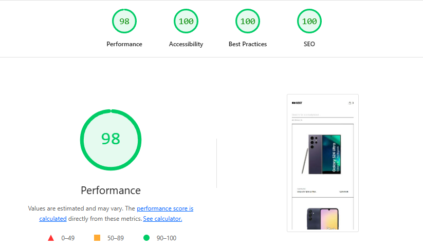
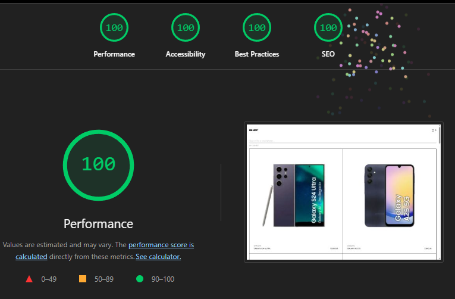
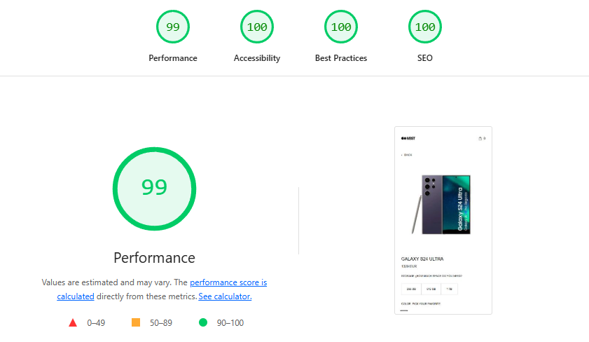
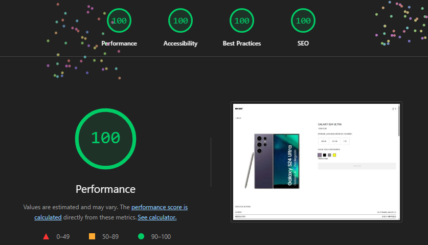
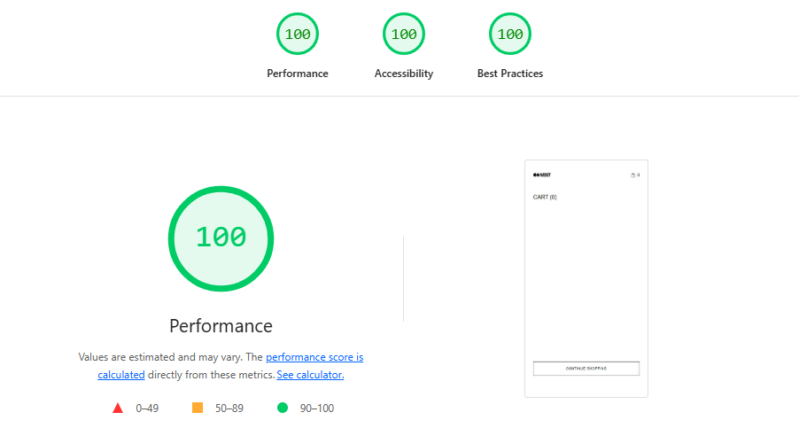
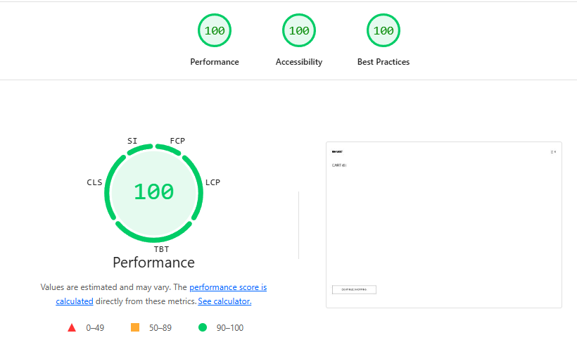

# Prueba Frontend Mobile Shop

## Introducción

Este documento recoge el desarrollo de una prueba técnica para una tienda de móviles, una aplicación web de `e-commerce` centrada en la visualización, búsqueda y gestión de un catálogo de dispositivos móviles. En este README voy a explicar cómo está estructurado el proyecto, las decisiones que he tomado durante su desarrollo, qué funcionalidades incluye y qué mejoras aplicaría si dispusiera de más tiempo.

---

## Producción

URL: [https://prueba-frontend-mobile-shop.vercel.app/](https://prueba-frontend-mobile-shop.vercel.app/phones)

## Cómo correr el proyecto localmente

> Este proyecto ha sido desarrollado con **Node.js v20.19.0** y **Next.js 16**.
> 

### IMPORTANTE

Se necesita tener el proyecto backend vivo y tener un archivo de variables de entorno con los siguientes nombre:

```
API_HOSTNAME
NEXT_PUBLIC_API_KEY
NEXT_PUBLIC_API_BASE_URL
NEXT_PUBLIC_SITE_URL
```

### Instalación

1. Para instalar el proyecto con las dependencias:
    
    ```bash
    npm install
    ```
    
2. Para configurar Husky (para los git hooks):
    
    ```bash
    npm run prepare
    ```
    
3. Para instalar los navegadores de Playwright (necesarios para tests E2E):
    
    ```bash
    npx playwright install
    ```
    

### Comandos disponibles

| Comando | Descripción |
| --- | --- |
| `npm run dev` | Arranca el servidor de desarrollo en modo local |
| `npm run build` | Genera la build de producción |
| `npm run start` | Inicia el servidor de la build de producción |
| `npm run test` | Ejecuta todos los tests unitarios e integración |
| `npm run test:coverage` | Genera el informe de cobertura de tests |
| `npm run test:e2e` | Ejecuta los tests end-to-end con Playwright |
| `npm run test:e2e:ui` | Abre la interfaz visual de Playwright para debugging |
| `npm run lint` | Ejecuta el linter para verificar el código |
| `npm run format` | Formatea el código siguiendo las reglas de Prettier |
| `npm run storybook` | Arranca Storybook para visualizar componentes |
| `npm run build-storybook` | Genera el build de storybook |

### Arranque

Para ver la aplicación funcionando, se utiliza el comando:

```bash
npm run dev
```

La aplicación estará disponible en `http://localhost:3000` y dependerá de un backend levantado en la dirección especificada en las variables de entorno.

### Build

Para hacer el build de la aplicación, tenemos que ejecutar:

```bash
npm run build
```

Una vez completado, para ejecutar el servidor de producción:

```bash
npm run start
```

### Test

Para ejecutar los tests unitarios y de integración, se utiliza el comando:

```bash
npm run test
```

Para generar un informe de cobertura:

```bash
npm run test:coverage
```

Para los tests E2E con Playwright:

```bash
npm run test:e2e
```

Si se prefiere usar la interfaz visual de Playwright para depurar tests:

```bash
npm run test:e2e:ui
```

> **Nota**: Los tests E2E requieren que la aplicación esté levantada en segundo plano.
> 

### Storybook

Para arrancar storybook utilizamos el comando:

```bash
npm run storybook
```

Para hacer el build de storybook utilizamos el comando:

```bash
npm run build-storybook
```

---

## Decisiones técnicas tomadas

### Stack tecnológico

### Next.js 16 como framework

He elegido **Next.js** como framework principal por varios motivos:

- **SSR nativo**: La gestión del `SSR` que dispone Next ayuda a un fácil desarrollo del código ejecutado en producción.
- **App Router moderno**: La estructura de directorios del `App Router` simplifica enormemente la estructura del proyecto
- **Optimizaciones automáticas**: Next.js provee mejoras estructurales predeterminadas, incluyendo carga diferida (`lazy loading`) de recursos o optimización de imágenes entre otras para garantizar una navegación rápida.

### React 19 + TypeScript

React 19 junto con TypeScript forma la base del proyecto. TypeScript no solo ayuda a prevenir errores en tiempo de desarrollo, sino que también sirve como documentación viva del código.

### SASS + CSS Modules

He elegido **SASS** como preprocesador CSS porque permite seguir una estructura jerárquica de los estilos y facilita la reutilización de código usando `mixins`.

Además de SASS, el proyecto utiliza **CSS Variables** para crear un sistema de `tokens` consistente a lo largo de la aplicación, lo que permite cambios globales en el tema sin modificar archivos individuales.

### TanStack Query (React Query)

Para la gestión del estado del servidor he optado por **TanStack Query** en el lado del cliente pero conectada con el `SSR` de NextJS para gestionar una cache inteligente con los datos.

### React Context API para el carrito

Para la gestión del estado de la aplicación he elegido **React Context API** en combinación con `localStorage` para la persistencia. El carrito se mantiene en memoria durante la sesión y se persiste en `localStorage` para que el usuario no pierda su selección al refrescar la página. Esta decisión proporciona un equilibrio entre simplicidad y efectividad sin necesidad de librerías adicionales. también se provee las acciones de añadir y quitar item del carrito, el número total de items y el precio total del carrito

---

## Arquitectura de la Aplicación

### Componentes reutilizables (Design System)

He creado un sistema de componentes básicos que sirven como bloques de construcción para la interfaz:

- **Button**: Componente de botón con variantes (primary, ghost, danger)
- **Grid**: Sistema de grid responsive para layouts
- **Card**: Contenedor base para tarjetas de teléfonos
- **Input**: Campos de entrada con validación
- **OptionSelector**: Selectores para almacenamiento y color

Estos componentes están documentados en **Storybook.**

### Estructura de carpetas por features

He organizado el código siguiendo una arquitectura orientada a **features**, donde cada funcionalidad está contenida en su propia carpeta:

```
src/
├── app/              → Configuración de rutas (App Router de Next.js)
├── assets/           → Recursos estáticos
├── config/           → Valores estáticos de configuración de la aplicación
├── context/          → Contextos que utiliza la aplicación
├── domain/           → Tipos y lógica de dominio (Phone, Cart)
├── features/         → Componentes con lógica organizados por funcionalidad
│   ├── phoneList/    → Vista del listado de teléfonos
│   ├── phoneDetail/  → Vista del detalle del teléfono
│   ├── cart/         → Vista del carrito
│   └── layout/       → Componentes de layout
├── mocks/            → Mocks para realizar tests
├── services/         → Capa de comunicación con APIs
├── styles/           → Estilos globales y tokens
└── ui/               → Componentes del design system

tests/
├── e2e/              → Tests de integración
└── fixtures/         → Fixtures de Playwright con helpers
```

Esta estructura tiene varios beneficios:

- **Escalabilidad**: Si mañana necesito añadir una nueva funcionalidad, solo tengo que diferenciar entre posibles componentes del `design system` y componentes pertenecientes a la funcionalidad.
- **Separación por capas:** Aunque no están las capas desacopladas completamente, si mañana cambiase algo del api, el cambio quedaría acotado a la capa de `services`, si mañana la interfaz quiere cambiar la manera de usar los datos de la API, solo tiene que modificar el dominio afectado y adaptar la salida del `mapper` del servicio. Esto permite cambiar fácilmente la fuente de datos sin afectar el resto de la aplicación.

### Capa de servicios

La comunicación con el backend se centraliza en la carpeta `services/`, separando la lógica de API en la gestión global de las peticiones (`httpClient`) y en todo lo correspondiente a las peticiones de los teléfonos (`PhoneService`). Si el día de mañana se añadiese otra categoría de peticiones (por ejemplo, orders), desarrollaría la siguiente estructura:

- **Types de la API**: Para tipar todo aquello que entra de la api
- **Service:** El servicio en sí.
- **Mapper:** Para adaptar el resultado de la api a lo que quiera/necesite la interfaz (y así facilitar el desacople)
- **keys:** En caso de usar `tanstack query` para consumir estas peticiones, tener un archivo donde centralizar las claves con las que se definen las cachés.

### Hooks personalizados

He creado hooks reutilizables que encapsulan lógica común:

- **usePhoneList**: Gestión del listado con búsqueda, y filtros con `tanstack-query`
- **usePhoneDetail**: Carga y gestión del detalle de un teléfono específico con `tanstack-query`
- **useDebounce**: Debouncing para búsquedas en la lista de teléfonos
- **useNavigationProgress**: Indicador visual de progreso entre navegaciones y peticiones

---

## Testing

### **Vitest**

Utilizo Vitest para ejecutar los tests unitarios e integración por su rapidez de ejecución de test y como alternativa más potente a `Jest`.

### **React Testing Library**

La utilizo como herramienta fundamental para los tests de integración. Es la librería que siempre he utilizado para realizar los test de integración de una aplicación de React.

### **Playwright**

He utilizado Playwright como herramienta de testing E2E por su alta demanda en el mercado, su facilidad de uso y su mayor velocidad comparado con alternativas como Cypress. Dentro esta agrupada la configuración en dos proyectos, mobile y desktop, para una mayor cobertura. Además se configuran `fixtures` para interceptar las peticiones a la api y mockear la salida.

### Cobertura de tests

La aplicación alcanza una cobertura de más del 90**% de líneas de código**, incluyendo:

- Tests de componentes principales (PhoneList, PhoneDetail, Cart)
- Tests de hooks personalizados
- Tests E2E de flujos críticos
- Tests de accesibilidad en componentes y global

## Performance

Adjunto imágenes de análisis de `lighthouse` para analizar el rendimiento de la aplicación:

### Vista Listado de Teléfonos

Mobile: 

Desktop: 

### Vista Detalle de Teléfonos

Mobile: 

Desktop: 

### Vista Carrito

Mobile: 

Desktop: 

---

## Ecosistema y Calidad (DX)

### **Storybook**

He incluido Storybook como catálogo de componentes. De esta manera, puedo ver los componentes del `design system` de manera aislada, sin necesidad de disponer de la aplicación levantada ni tener datos del backend. Es útil para probar rápidamente los componentes del UI y sirve de documentación visual de los componentes que se usan en la aplicación.

### **ESLint + Prettier**

He utilizado la combinación de ESLint y Prettier para garantizar una base de código limpia y homogénea.

- **ESLint** detecta problemas de código y malas prácticas
- **Prettier** asegura un formato consistente

De esta manera, se consigue que cualquier persona que trabaje en el proyecto siga las mismas reglas y formatos, promoviendo una coherencia de desarrollo por la aplicación.

### **Husky + commitlint**

He configurado **Husky** para gestionar Git Hooks:

- Pre-commit: Ejecuta validación de linting y formatting
- Commit-msg: Valida que los mensajes de commit sigan el estándar `conventional-commits`

Esto asegura que todo lo que entra al repositorio siga un formato consistente y fácil de auditar.

---

## Funcionalidades implementadas

### Vista Listado de Teléfonos

La página principal muestra una **cuadrícula responsive con tarjetas de teléfonos**:

- **Búsqueda en tiempo real**: Filtra los teléfonos por nombre o marca. La búsqueda es debounced para evitar peticiones innecesarias al backend
- **Actualización de URL según busqueda:** La búsqueda actualiza la url con los parámetros de búsqueda para poder compartir búsquedas por url
- **Indicador de resultados**: Muestra cuántos teléfonos coinciden con la búsqueda actual
- **Navegación**: Barra superior con logo y carrito que muestra la cantidad de productos
- **Tarjetas de producto**: Cada tarjeta incluye imagen, marca, nombre y precio base
- **Clic para detalle**: Al hacer clic en un teléfono, redirige a la vista de detalle

### Vista Detalle de Teléfono

Al seleccionar un teléfono, la aplicación muestra:

- **Imagen dinámica**: La imagen cambia según el color seleccionado
- **Selectores interactivos**:
    - Selector de color con vista previa en tiempo real
    - Selector de almacenamiento con actualización de precio
- **Especificaciones técnicas**: Detalles completos del dispositivo
- **Actualización de precio**: Se recalcula dinámicamente según las opciones seleccionadas
- **Botón “Añadir al carrito”**: Solo se activa cuando se han seleccionado color y almacenamiento
- **Productos similares**: Sección inferior mostrando teléfonos de la misma categoría

### Vista de Carrito

El carrito de compras incluye:

- **Listado de productos**: Con imagen, nombre, especificaciones seleccionadas (color/almacenamiento) y precio
- **Eliminación de productos**: Botón para remover items individuales del carrito
- **Persistencia**: El carrito se guarda en `localStorage`, manteniéndose incluso después de cerrar la página
- **Precio total**: Cálculo dinámico del costo total
- **Botón “Continuar comprando”**: Redirige de vuelta al listado principal
- **Botón “Comprar”:** El botón de compra “simula” realizar la compra, vaciando todo el carrito

### Diseño responsive

La aplicación está **completamente adaptada a móvil y escritorio con un paso intermedio adaptado en tablet**:

- Los layouts se ajustan automáticamente según el tamaño de pantalla
- La navegación es intuitiva tanto en mobile como en desktop
- Las imágenes se optimizan según el dispositivo
- El texto es legible en todos los tamaños
- Uso de grid flexible que se reorganizan según la pantalla

### Accesibilidad

La aplicación ha sido desarrollada pensando en la accesibilidad:

- Uso de elementos semánticos HTML
- Atributos ARIA donde es necesario
- Tests de accesibilidad automáticos con `axe-core`
- Contraste de colores adecuado
- Texto alt en todas las imágenes

### SEO

La aplicación ha tenido en cuenta los aspectos SEO para una posible tienda de teléfonos

- Añadidos metadata para toda la aplicación, siendo dinámico para las urls con `params` de la búsqueda y para la vista de detalle de teléfono
- Pre-renderizado estático de detalle de teléfono con `generateStaticParams`
- Añadida funcionalidad de `opengraph-image` para disponer de imagenes a la hora de compartir la url
- Generado Sitemap dinámico
- Archivo robots.txt generado para crawlers

### Funcionalidad global

Añadida cierta configuración a nivel global para dar más robustez a la aplicación

- Error boundaries específicos por sección (/phones, /phones/[id], `/cart`)
- Página 404 personalizada con not-found.tsx
- Redirección automática de la ruta raíz al catálogo

---

## Qué mejoraría si tuviera más tiempo

### 1. Internacionalización (i18n)

Dada la distribución actual de las constantes, Integraría un sistema multilenguaje robusto tipo **React-i18next** para permitir que usuarios de distintos países usen la aplicación en su idioma de preferencia.

### 2. Modo oscuro

Dado el sistema de archivos dispuesto para los estilos, no sería muy complicado integrar un modo oscuro. Esto permitiría a usuarios con preferencias de tema reducir la fatiga ocular en ambientes oscuros.

### 3. Mejorar el Theming y token

He intentado seguir el diseño de Figma y seguir estilos lo más parecido posible siguiendo valores de escala con sentido, pero estoy seguro que ese sistema de token se puede, primero refinar, y después extender con más `mixins` o variables.

### 4. Interceptación de peticiones

Añadiría `Mock Service Worker` para interceptar peticiones directas a la API de forma consistente. A su vez usaría factorías con `fishery` que permitan seguir el tipado de la aplicación y con una serie de reglas sencillas, usar `faker`  para generar datos mock, que permitan flexibilidad para probar `corner-cases`. Adicionalmente se podría conectar `MSW` no solo a los tests si no, también a storybook y a la aplicación en `dev`  en el futuro para mantenerse independiente del estado de la api cuando estamos en desarrollo.

### 5. Desarrollar más los componentes del design system

Ahora mismo tenemos unos pocos componentes para entender la idea del `design system`, pero hay más componentes que se pueden generar que puedan ser potencialmente reutilizables como enlaces con y sin icono, el selector de color, etc.

### 6. Storybook refinado

Ahora mismo tenemos una base sencilla para comprender los distintos componentes de la aplicación pero sería un siguiente paso, revisar cada historia para ver posibles mejoras, ya no solo de la historia en sí si no también del propio componente pasando tests de accesibilidad, pruebas de interacción o análisis de rendimiento. También añadiría una documentación más extensa en cada componente para entender su uso y como utilizarlo, no solo los ejemplos.

### 7. Test de regresión visual

Dado el diseño de `Figma` y la necesidad de cubrir el responsive design, añadiría test de regresión visual, con `snapshots` de cada componente o sección para monitorizar posibles cambios visuales no deseados en la aplicación.

### 8. PWA

Dado que estamos en un contexto de una tienda de teléfonos, un añadido interesante podría ser la posibilidad de configurar que la aplicación sea `PWA` y así permitir los beneficios de este sistema tales como la instalación de la aplicación en dispositivos, la capacidad de operar offline, etc.

### 9. Documentación

Solo por rizar un poco el rizo, más allá de presentar un README, si se quiere desarrollar más la documentación se podría insertar algún sistema interno de documentación tipo `Docusaurus` para una documentación mejor desarrollada en la app.

---

## Qué funcionalidades añadiría a la aplicación

Estas serían alguna de las pequeñas funcionalidades que añadiría sin tocar nada más allá del frontend con impacto visual para el potencial cliente:

### 1. Paginación

Dado que el endpoint `/products` permite controlar el `limit` y el `offset`, si el día de mañana entrasen más valores al backend, se podría implementar un sistema de paginación utilizando esos valores.

### 2. Toast

Ahora mismo, si se añade un `item` al carrito, no se muestra en pantalla ningún mensaje que indique que el item se ha añadido al carrito. Añadiría un componente al `design system` de `Toast`, que sirva para informar ya sea en los `success` o en los `error` lo que este pasando. Otro ejemplo es, que cuando se le da al botón de pagar, informar de por qué se limpian los items del carrito.

### 3. Carrito compartible

Añadiría la capacidad de poder compartir el carrito por URL con metadatos personalizados, con generación dinámica de URLs para poder compartir ese carrito

### 6. Notificaciones push en ese hipotético PWA

Añadiría la base para unas notificaciones `push` en ese sistema de `PWA` que permita que, por ejemplo, si el usuario se ha dejado el carrito sin terminar de pagar, pasado x tiempo, se pueda mandar una notificación `push` recordándole al usuario que el carrito esta pendiente de ser comprado.

### 9. Integración con redes sociales

Dado que hemos añadido el sistema de `opengraph-image` para la generación de imágenes para compartir en la aplicación, una muy buena idea sería integrar botones de compartir por las distintas secciones en las principales redes sociales para así poder enviar los metadatos de una manera más enriquecida por las redes sociales.

---

## Conclusión

Este proyecto representa una aplicación de e-commerce moderna, con atención especial a la experiencia del usuario, la calidad del código y las mejores prácticas de desarrollo web. La arquitectura flexible y bien organizada permite que en el futuro sea fácil añadir nuevas funcionalidades y mantener la calidad del código a medida que crece el proyecto.

La inversión en testing, linting y buenas prácticas de desarrollo hace que sea una base sólida para continuar el desarrollo y escalar la aplicación de manera sostenible.